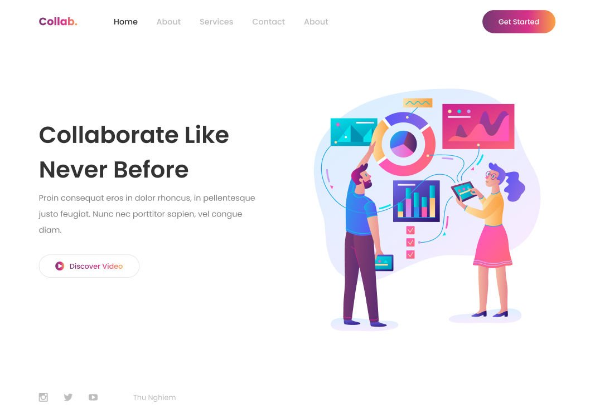

# Build a Responsive Website Using HTML and CSS in 30 minutes

This repository has a responsive website made it in 30 minutes, referencing a tutorial available at [Thu Nghiem YouTube Channel](https://www.youtube.com/watch?v=d-qVF18Q7es&feature=youtu.be).