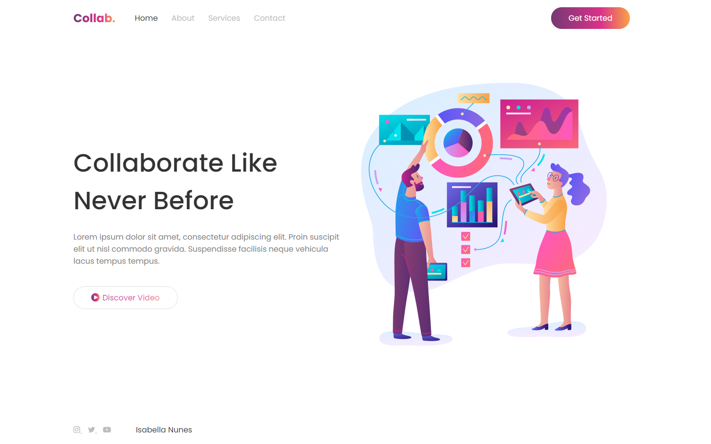

<h1 align="center">
    Responsive website using HTML and CSS in 30 minutes
</h1>

    
    
    
    

 

    

 

## Technologies and requirements
- HTML
- CSS

## Project
This repository has a responsive website made it in 30 minutes, referencing a tutorial available at [Thu Nghiem YouTube Channel](https://www.youtube.com/watch?v=d-qVF18Q7es&feature=youtu.be).

## Run
Just open the [index.html](index.html) in any browser.

## Status
Done ✅

## License
This project is under the MIT License. See [LICENSE](/LICENSE.md) file for more details.